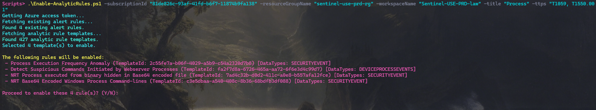

# Enable-AnalyticTemplates.ps1



## Overview

This PowerShell script enables Microsoft Sentinel Analytic Rules from Rule templates with **flexible command-line filtering**.  
It supports filtering by:

- **Title** (partial, case-insensitive)
- **MITRE ATT&CK TTPs** (exact, any in list, e.g., T1059, T1562.001)
- **DataType / Table** (exact, single table, e.g., SecurityAlert, DeviceProcessEvents, AzureDiagnostics)
- **AND/OR logic** between filters

The script ensures authentication, preserves baseline packaging, and checks all required data connectors for each analytic rule template.

---

## Features

- **Flexible Filtering:**  
  - Filter by rule display name, MITRE TTPs, and/or required data types (tables).
  - Combine filters with AND (default) or OR (`-or`).
- **DataType Matching:**  
  - Checks all `requiredDataConnectors[*].dataTypes` for every template, across all connectors.
  - Normalizes table names (e.g., `"SecurityAlert (ASC for IoT)"` → `"SecurityAlert"`).
- **Confirmation Prompt:**  
  - Lists all rules to be enabled and asks for confirmation before proceeding.
- **Idempotent:**  
  - Skips rules that already exist in the workspace.
- **Clear Output:**  
  - Summarizes created, skipped, and failed rules.

---

## Usage

### Prerequisites

- PowerShell 7+
- Az.Accounts module (`Install-Module Az.Accounts`)
- Logged in to Azure (`Connect-AzAccount`)

### Running the Script

#### Filter by display name (contains, case-insensitive)
```powershell
.\Enable-AnalyticTemplates.ps1 -subscriptionId "<subId>" -resourceGroupName "<rg>" -workspaceName "<workspace>" -title "TI Map"
```
#### Filter by required table/dataType (normalized)
```powershell
.\Enable-AnalyticTemplates.ps1 -subscriptionId "<subId>" -resourceGroupName "<rg>" -workspaceName "<workspace>" -datatype "SecurityAlert"
```
#### Filter by display name (contains, case-insensitive) and any of the provideded Mitre ATT&CK (sub)techniques
```powershell
.\Enable-AnalyticTemplates.ps1 -subscriptionId "<subId>" -resourceGroupName "<rg>" -workspaceName "<workspace>" -title "Process" -ttps "T1059, T1550.001"
```
#### Combine all three with AND (default)
```powershell
.\Enable-AnalyticTemplates.ps1 -subscriptionId "<subId>" -resourceGroupName "<rg>" -workspaceName "<workspace>" -title "Process" -ttps "T1059" -datatype "DeviceProcessEvents"
```
#### Use OR logic across provided filters
```powershell
.\Enable-AnalyticTemplates.ps1 -subscriptionId "<subId>" -resourceGroupName "<rg>" -workspaceName "<workspace>" -title "Process" -ttps "T1059" -datatype "DeviceProcessEvents" -or
```

---

## Troubleshooting

If you see authentication errors, ensure you have run Connect-AzAccount and have the correct permissions.
If no rules are matched, check your filter spelling and normalization (e.g., "SecurityAlert" not "SecurityAlert (ASC for IoT)").


## License
MIT License

## Contributors
👾[DylanInfosec](https://twitter.com/DylanInfosec)
